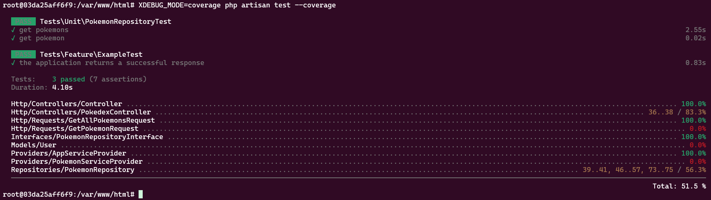

## Launching

- Clone repository
- `cd php-test` - go to project directory
- `cp .env.example .env` - copy environment files
- `./install.sh` or `./start.sh` - run docker containers for project: PHP and MySQL
- `docker ps` - find running PHP container name, f.e.: `php-test-php-1`
- `docker exec -it php-test-php-1 bash` - go inside of container
- run `composer install`
- run `npm install`
- run `php artisan migrate:fresh`
- `./stop.sh` - to stop containers, if it needs

## Testing
- Inside of PHP container: `XDEBUG_MODE=coverage php artisan test --coverage`

## UI examples
- Use url `http://127.0.0.1/`
- Character image isn't available

